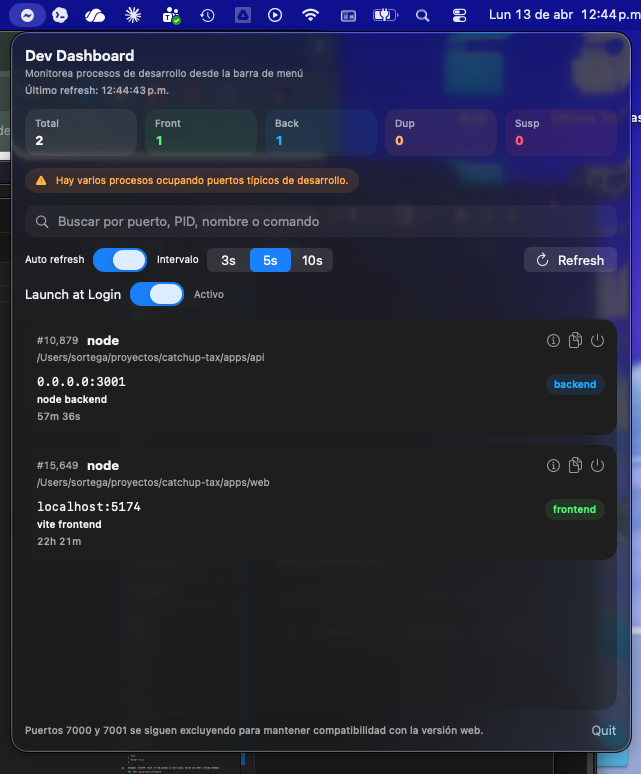

# Dev Dashboard

Dev Dashboard is a local macOS tool for developers that shows development processes listening on ports and lets you stop them from a fast, readable UI.



## Author

Sebastian Ortega

## License

This project is licensed under the MIT License. See [LICENSE](./LICENSE).

## Prebuilt App

This repository includes a prebuilt notarized macOS app for users who do not want to compile it locally:

- `release/Dev Dashboard.app`
- `release/Dev Dashboard.zip`
- `release/SHA256SUMS.txt`

If you download the repository as a zip from GitHub, you can open the app directly from the `release/` folder.

## Release Policy

- Source code contributions are welcome through pull requests.
- Prebuilt release artifacts in `release/` are maintained by Sebastian Ortega.
- Contributors should not replace the bundled `.app`, `.zip`, or checksum files unless a release update has been explicitly requested.
- Official release artifacts should only be updated from a signed and notarized build.

## What It Does

- Detects development processes listening on TCP ports.
- Shows PID, process name, full command, ports, address, runtime, working directory, and estimated app type.
- Highlights duplicated or suspicious processes.
- Supports manual refresh, auto refresh, search, and process termination.
- Can terminate all processes associated with the same project folder when that can be inferred.

## Stack

- Frontend: React + Vite
- Backend: Node.js + Express
- System detection: `lsof` + `ps`
- Native menubar app: Swift + SwiftUI + MenuBarExtra

## Minimal Architecture

```text
dev_dashboard/
├── client/               # React/Vite UI
│   ├── src/App.jsx
│   ├── src/main.jsx
│   └── src/styles.css
├── server/               # Local API + macOS detector
│   └── src/
│       ├── config.js
│       ├── index.js
│       └── processScanner.js
├── menubar-app/          # Native Swift app
├── release/              # Prebuilt notarized app assets
├── package.json          # Root scripts and metadata
└── README.md
```

## Requirements

- macOS
- Node.js 20+ recommended
- npm 10+ recommended
- Xcode 15+ to package the menubar app as a `.app`
- XcodeGen (`brew install xcodegen`) to regenerate the native project

## Installation

```bash
npm install
```

## How To Run

### Full Development Mode

Starts backend and frontend with a single command:

```bash
npm run dev
```

### Backend Only

```bash
npm run server
```

### Frontend Only

```bash
npm run client
```

### Native Menubar App

Build and run the menu bar app:

```bash
npm run menubar:run
```

Build only:

```bash
npm run menubar:build
```

You can also open the Swift package in Xcode:

```bash
open menubar-app/Package.swift
```

Generated Xcode project:

```bash
npm run menubar:project
npm run menubar:open
```

Archive from the command line:

```bash
npm run menubar:archive
```

Install locally into `/Applications`:

```bash
npm run menubar:install
```

This generates the icons, rebuilds the `.xcodeproj`, creates a Release archive, and copies `Dev Dashboard.app` into `/Applications`.

Notarize the exported app:

```bash
npm run menubar:notarize
```

The script first looks for `APPLE_NOTARYTOOL_PROFILE` in Keychain. If it is not available, it falls back to `APPLE_ID`, `APPLE_TEAM_ID`, and `APPLE_APP_PASSWORD`.

## Local URLs

- UI: [http://127.0.0.1:7001](http://127.0.0.1:7001)
- API: [http://127.0.0.1:7000/api/processes](http://127.0.0.1:7000/api/processes)

The tool listens only on `127.0.0.1`.

## npm Scripts

- `npm run dev`: starts backend + frontend.
- `npm run server`: starts the local backend.
- `npm run client`: starts the local UI.
- `npm run menubar:run`: runs the Swift menubar app.
- `npm run menubar:build`: builds the Swift menubar app.
- `npm run menubar:icon`: generates the full PNG icon set for `AppIcon`.
- `npm run menubar:project`: generates the `.xcodeproj` with XcodeGen.
- `npm run menubar:open`: opens the menubar Xcode project.
- `npm run menubar:archive`: creates a Release `.xcarchive` through Xcode build tools.
- `npm run menubar:install`: installs a local build of the menubar app into `/Applications`.
- `npm run menubar:notarize`: zips the exported `.app`, submits it to Apple, applies `staple`, and validates Gatekeeper.
- `npm run build`: builds the frontend.
- `npm run start`: starts the backend without watch mode.

## Native Menubar App

The `menubar-app/` folder contains a native Swift version that does not depend on the Node backend for process detection. It reimplements the detector using the same system commands and provides:

- always-on access from the macOS menu bar
- manual and automatic refresh
- native `Launch at Login` toggle using `SMAppService.mainApp`
- search by PID, port, name, or command
- frontend/backend/duplicated/suspicious badges
- process detail view with useful terminal commands
- process or project termination with confirmation

Assets and packaging:

- `scripts/generate-menubar-icons.swift` generates `AppIcon.appiconset`
- `scripts/install-menubar-app.sh` builds and installs a local `.app` into `/Applications`
- `scripts/notarize-menubar-app.sh` notarizes the exported `.app`
- `menubar-app/project.yml` defines the bundle id, `LSUIElement`, category, and asset catalog for the Xcode project

## System Commands Used

Detection relies on native macOS commands:

### 1. Listening TCP sockets

```bash
lsof -nP -iTCP -sTCP:LISTEN -Fpcn
```

Used to obtain:

- PID
- short process name
- listening sockets
- detected port and address

### 2. Process details

```bash
ps -ww -o pid=,ppid=,user=,etime=,args= -p <pid-list>
```

Used to obtain:

- full command
- user
- approximate runtime

### 3. Working directory

```bash
lsof -a -d cwd -p <pid-list> -Fn
```

Used to infer the project folder when the process exposes it.

## Local API

### `GET /api/health`

Simple healthcheck.

### `GET /api/processes`

Returns structured JSON with:

- `processes`
- `summary`
- `warnings`
- `generatedAt`

### `POST /api/processes/:pid/terminate`

Body:

```json
{
  "force": false
}
```

Attempts `SIGTERM` first. If the process is still alive, the UI can offer a forced shutdown.

### `POST /api/projects/terminate`

Body:

```json
{
  "cwd": "/path/to/project",
  "force": false
}
```

Terminates all detected processes with the same working directory.

## Scope Covered In This First Version

- Table with PID, process, command, ports, address, runtime, cwd, and estimated type.
- Fast filter by PID, port, name, command, or folder.
- Manual refresh.
- Auto refresh every few seconds.
- Copy command button.
- Kill process button.
- Kill project action from the detail panel.
- Confirmation before stopping processes.
- `SIGTERM` first, `SIGKILL` only if needed.
- Explicit exclusion of ports `7000` and `7001` so the tool does not list itself.

## Validation Performed

The real flow was tested on macOS with:

- detection of a real Vite server
- detection of a real Node backend
- termination of both through the dashboard API itself
- refresh afterward confirming that both disappeared from the list
- clean compilation of the Swift menubar app with `swift build --package-path menubar-app`
- real startup of the Swift menubar app as a native process
- correct generation of the Xcode project with `xcodegen`
- successful `.xcodeproj` build with `xcodebuild`
- successful signing and notarization of the exported `.app`

## Security And Scope

- The web UI and backend listen only on `127.0.0.1`.
- Detection is performed locally with `lsof` and `ps`.
- Process termination always requires explicit user action from the UI.
- No runtime telemetry or external network service is required for normal use.
- The only external service used in the release workflow is Apple notarization, and only when you explicitly run it.

## Known Limitations

- Classification is heuristic. Vite and Next are fairly reliable; other servers may remain `unknown`.
- Only TCP sockets in `LISTEN` state are considered. Processes without an open listening port are not shown.
- Some protected system processes or apps may not expose `cwd`, so the folder may appear as `unknown`.
- Process termination depends on the current user permissions. It does not attempt privilege escalation.
- `Launch at Login` uses `SMAppService`, but Apple requires a signed app. The build installed by `npm run menubar:install` is useful for local use; for reliable auto-start you should archive and sign from Xcode with your Team.
- If a process reuses ports or exposes multiple unusual sockets, duplicate detection may not be perfect.
- This first version is designed for macOS and is not adapted to Linux or Windows.
- The menubar app is distributed as an executable Swift package; for a fully packaged signed `.app`, opening `menubar-app/Package.swift` in Xcode and archiving from there is the most practical route.
- The `Launch at Login` toggle requires a properly signed app; from `swift run` or unsigned builds it may fail with an invalid-signature error.

## Usage Notes

- If you see several processes with the same folder and type, treat them as potential duplicates.
- If a process does not stop with a normal shutdown, the UI offers a forced stop.
- The tool is never exposed outside localhost.
